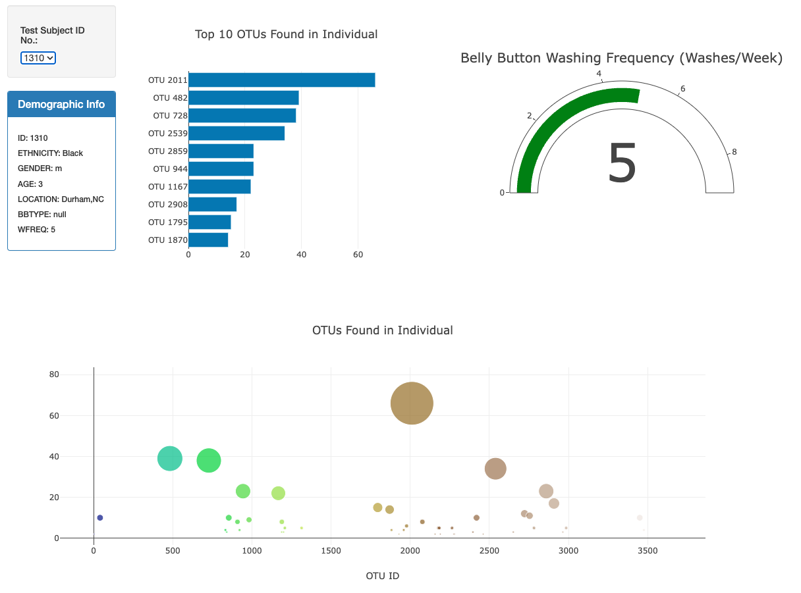
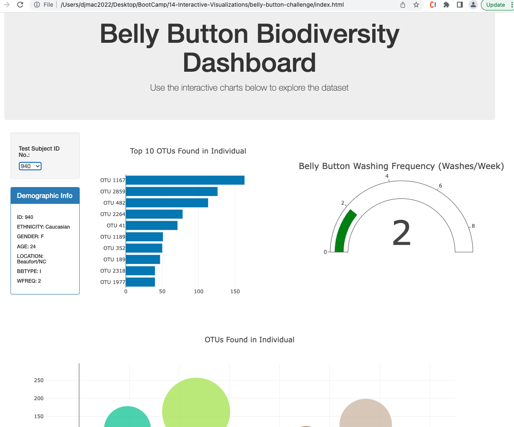

# belly-button-challenge
Module 14 Challenge - Interactive Visualizations with JavaScript - April 2023

## Background
This assignment required the creation of an interactive dashboard to explore the Belly Button Biodiversity dataset which catalogs the microbes that colonize human navels. The dataset indicates that a small handful of microbial species (also called operational taxonomic units, or OTUs, in the study) were present in more than 70% of people, while the rest were relatively rare.

## Summary
1. The D3 library was used to read in the json from the url.
2. A horizontal bar chart was created with a dropdown menu to display the top 10 OTUs found in that individual.
    - sample_values were the values for the bar chart
    - otu_ids were the labels for the bar chart
    - otu_labels were the hovertext for the chart
3. A bubble chart was created that displays each sample
    - otu_ids were the x values
    - sample_values were the y values
    - sample_values indicated the marker size
    - otu_ids indicated the marker colors
    - otu_labels indicated the text values
4. The sample metadata (i.e., an individual's demographic information) was displayed
5. Each key-value pair from the metadata JSON object was displayed on the page
6. All the plots are updated when a new sample is selected
7. The app was deployed to a free static page hosting service.
8. Extra: A Gauge Chart was generated using https://plot.ly/javascript/gauge-charts/Links to show the weekly washing frequency of the individual. The chart also updates whenever a new sample is selected.

